## Writeup Template

---

**Advanced Lane Finding Project**

The goals / steps of this project are the following:

* Compute the camera calibration matrix and distortion coefficients given a set of chessboard images.
* Apply a distortion correction to raw images.
* Use color transforms, gradients, etc., to create a thresholded binary image.
* Apply a perspective transform to rectify binary image ("birds-eye view").
* Detect lane pixels and fit to find the lane boundary.
* Determine the curvature of the lane and vehicle position with respect to center.
* Warp the detected lane boundaries back onto the original image.
* Output visual display of the lane boundaries and numerical estimation of lane curvature and vehicle position.

[//]: # (Image References)

[image1]: ./examples/undistort_output.png "Undistorted"
[image2]: ./test_images/test1.jpg "Road Transformed"
[image3]: ./examples/binary_combo_example.jpg "Binary Example"
[image4]: ./examples/warped_straight_lines.jpg "Warp Example"
[image5]: ./examples/color_fit_lines.jpg "Fit Visual"
[image6]: ./examples/example_output.jpg "Output"
[video1]: ./project_video.mp4 "Video"

## [Rubric](https://review.udacity.com/#!/rubrics/571/view) Points

### Here I will consider the rubric points individually and describe how I addressed each point in my implementation.  

---

### Writeup / README

#### 1. Provide a Writeup / README that includes all the rubric points and how you addressed each one.  You can submit your writeup as markdown or pdf.  [Here](https://github.com/udacity/CarND-Advanced-Lane-Lines/blob/master/writeup_template.md) is a template writeup for this project you can use as a guide and a starting point.  

You're reading it!

### Camera Calibration

#### 1. Briefly state how you computed the camera matrix and distortion coefficients. Provide an example of a distortion corrected calibration image.

The code for this step is contained in lane_line_img_processing.py for lines 52 through 110.

The first step in the calibration is collecting object points. These are 3D points in the world. The world frame is defined such that the origin is the upper left of the checkerboard pattern  in the images, the x axis is along one side of the checkerboard and the y axis is along the other. The checkerboard is the plane z = 0. Therefore the image points are the same for all calibration images. The 3D points just need to be scaled properly - the actual size of the squares was not taken into account for this calibration since not supplied (assumed 1m by 1m squares).

Then, 2D image points are calculated for each image using the `cv2.findChessboardCorners` function. These are pixel positions in the calibration images.

The 2D and 3D points from each image are all appending to object point and image point arrays, then fed into the `cv2.calibrateCamera` function. Note that in some of the images, not all of the chessboard corners are visible. In this case, the image and object points were not appended to their respective arrays. 

I applied the resultant distortion correction matrix to the calibratoin images using `cv2.undistort` function and obtained the following chart as examples. I chose these examples because the pattern clearly becomes straight after being curved.

Original             |  Chessboard Corners | Undistorted |
|:-------------------------:|:-------------------------:|:------:|
|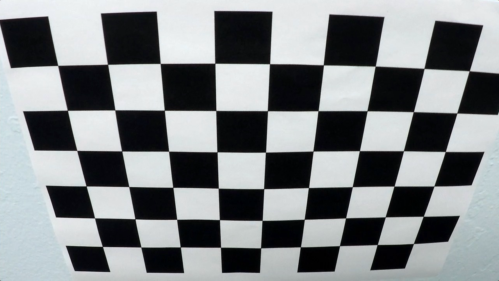  |  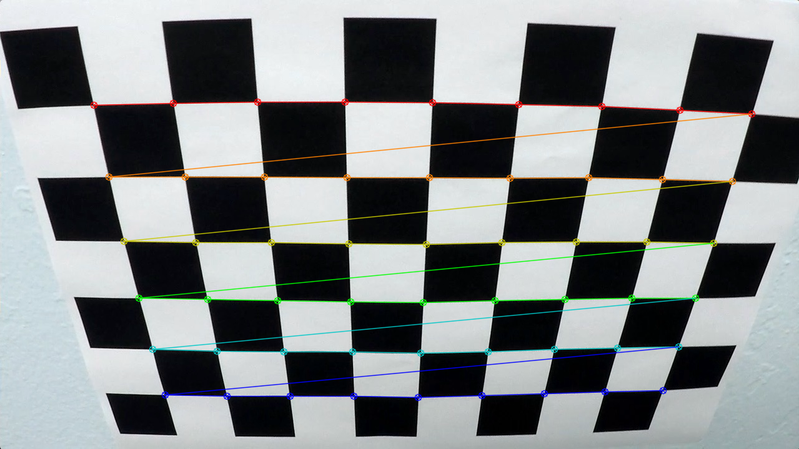 | 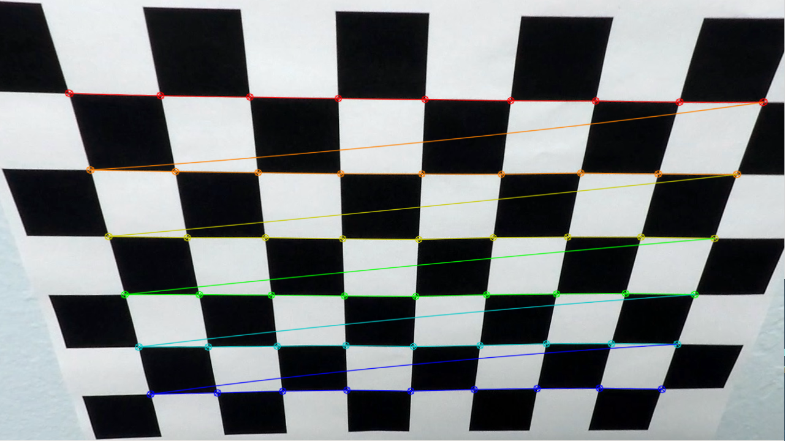|
|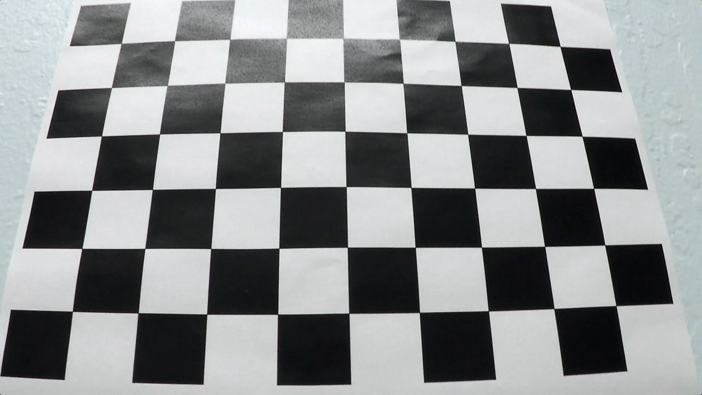  |  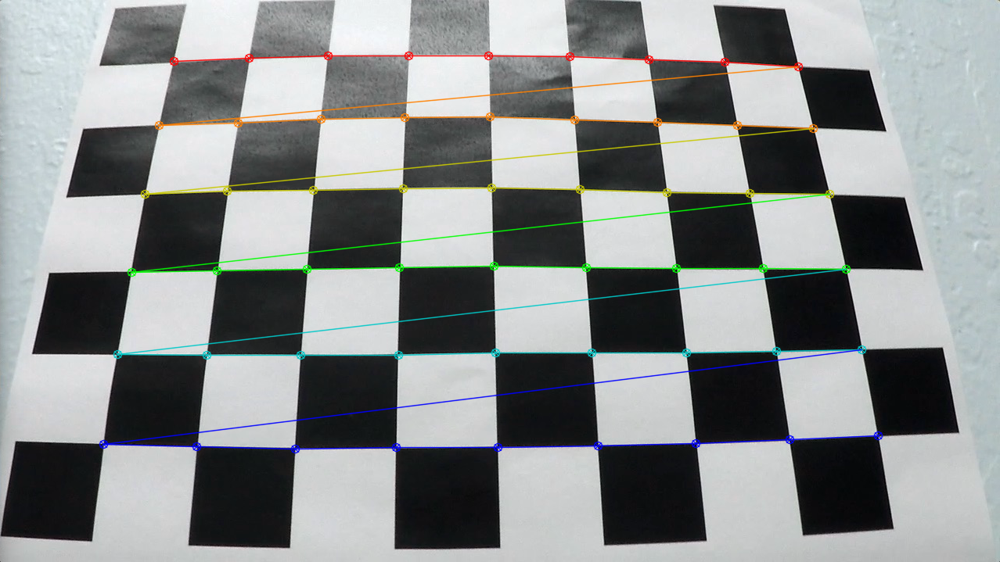 | 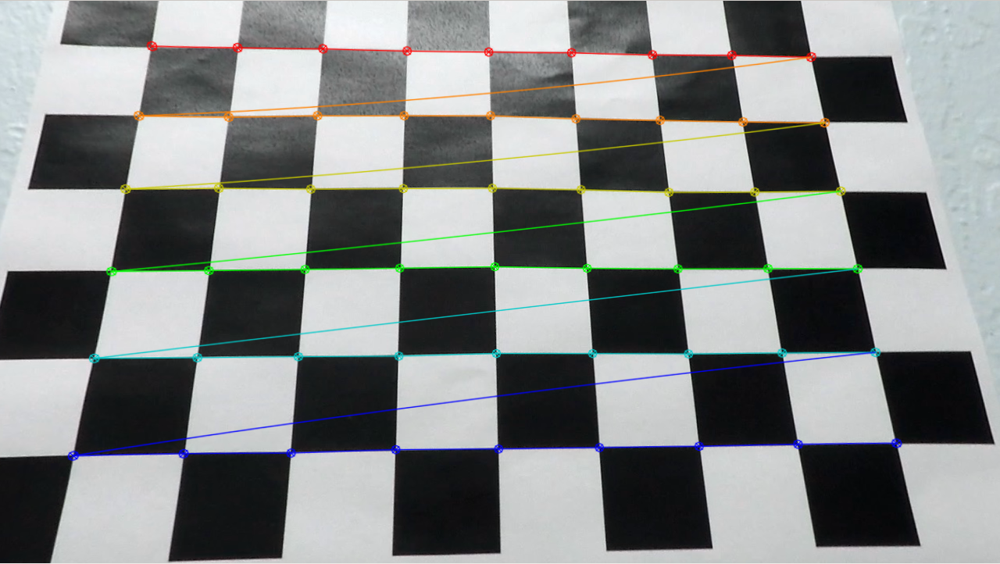|

### Pipeline (single images)

#### 1. Provide an example of a distortion-corrected image.

To demonstrate this step, I will describe how I apply the distortion correction to one of the test images like this one:

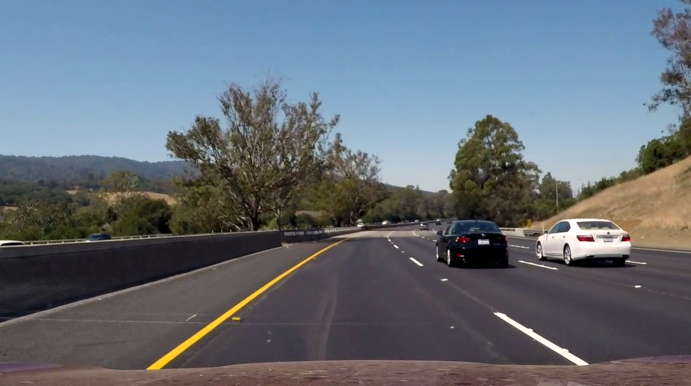

#### 2. Describe how (and identify where in your code) you used color transforms, gradients or other methods to create a thresholded binary image.  Provide an example of a binary image result.

I used a combination of color and gradient thresholds to generate a binary image (thresholding steps at lines # through # in `another_file.py`). Note that I performed the image processing after performing the perspective transform on the captured image.

First, I calculated the gradient direction and magnitude, and thresholded each to produce two binary images where I expect the lane lines to be. These are shown in the table below.

| Gradient Magnitude Thresholded | Gradient Direction Thresholded |
|:---:|:---:|
|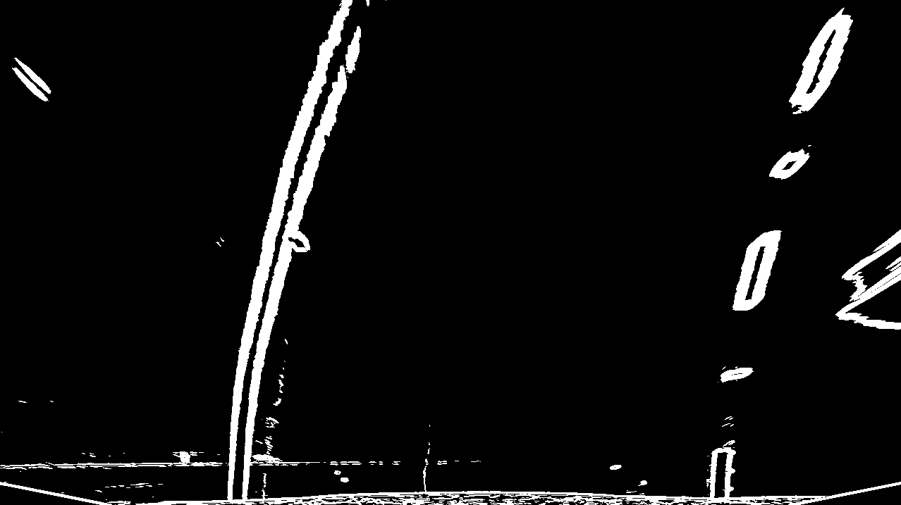|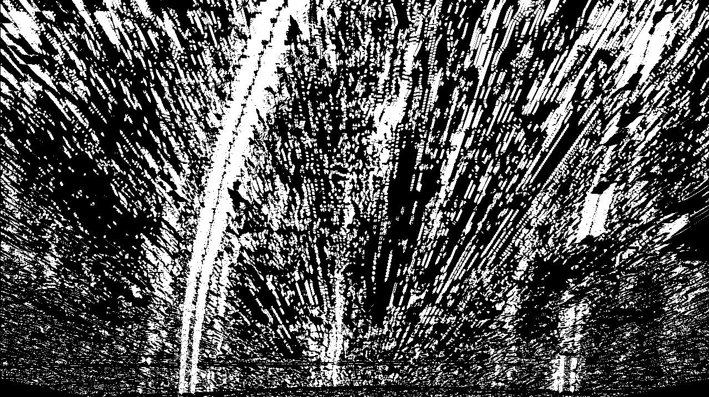|

Then, I calculated the bitwise_and of these two images to produce an edge based estimate of the lane line positions. I also applies colour filters to identify the white and yellow portions of the image. See the result of each of these thresholds in the table below.


| Lane Lines from Edge Information | Lane Lines from Colour Information |
|:---:|:---:|
| | 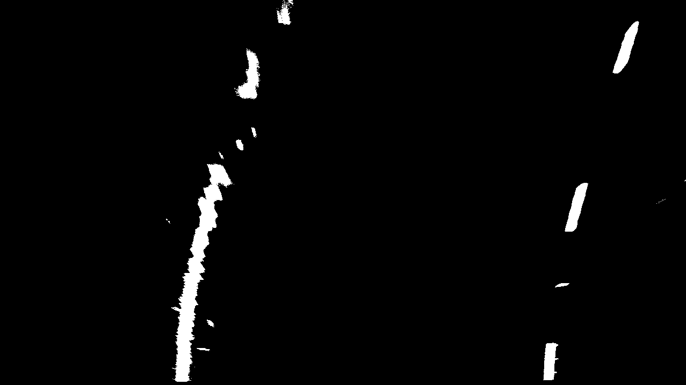|

Then, I bitwise_or'd the two of these to produce an overall estimate of the lane lines position.


Finally, I performed
- an erosion to remove noise
- a dilation to make the lane lines whole
- another erosion to return the lane lines to close to their original size

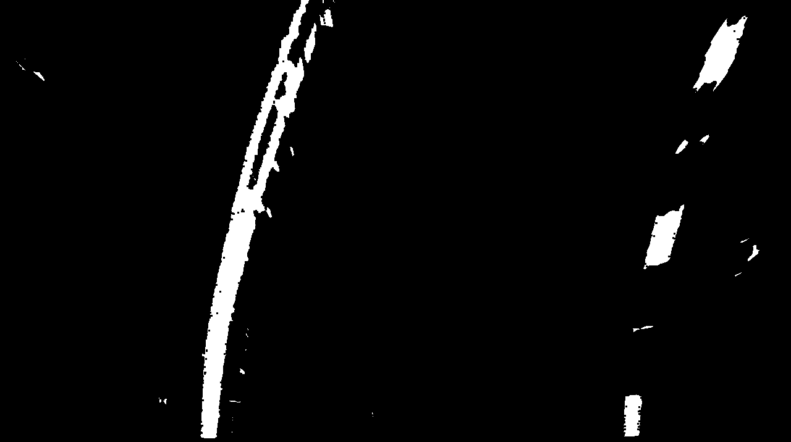
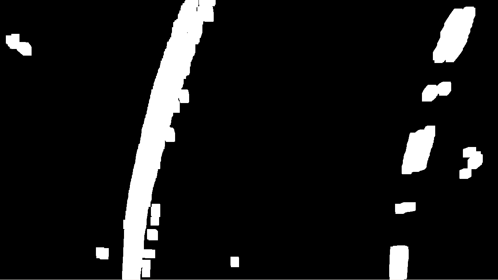
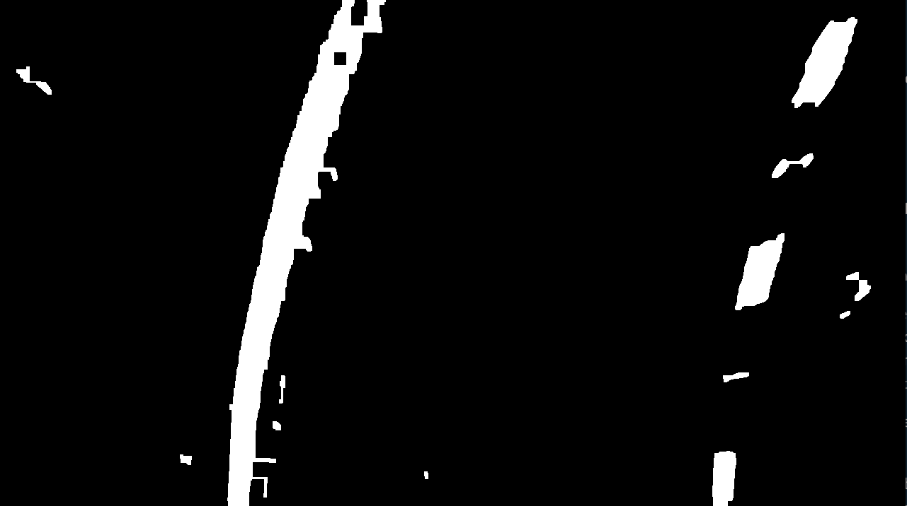

This last image is the output of the image processing part of my pipeline.

#### 3. Describe how (and identify where in your code) you performed a perspective transform and provide an example of a transformed image.

The code for my perspective transform is contained in the function perspective_tf_lane_lines in lane_line_img_processing.py. Lines X to Y of this file define the source and destination points. This code is also shown below. Then, I used the function `cv2.getPerspectiveTransform` to generate the perspective transformation matrix. Finally, I used the `cv2.warpPerspective` function to warp the image (named `image`) that was passed into the function.

```python

img_cols = image.shape[1]
img_rows = image.shape[0]

last_row = img_rows - 1
last_col = img_cols - 1

mid_col = int(img_cols * 0.5)
mid_row = int(img_rows * 0.5)

src = \
[
    [mid_col - 100, int(img_rows*0.63)],        # upper left
    [mid_col + 100, int(img_rows*0.63)],        # upper right
    [mid_col - 850, last_row],                  # lower left
    [mid_col + 850, last_row]                   # lower right
]

dst = \
[
    [0, 0],                                     # upper left
    [last_col, 0],                              # upper right
    [0, last_row],                              # lower left
    [last_col, last_row]                        # lower right
]

```

This resulted in the following source and destination points:


[[0, 0], [1279, 0], [0, 719], [1279, 719]]
| Source        | Destination   | 
|:-------------:|:-------------:| 
| 540, 453      | 0, 0        | 
| 740, 453      | 1279, 0      |
| -210, 719     | 0, 719      |
| 1490, 719      | 1279, 719        |

Note that the source points on the bottom row actually extend outside the bottom of the image.

I verified that my perspective transform was working as expected by checking whether or not the lane lines are vertical on a straight section of road.

| Source        | Destination (Perspective Transform)   | 
|:-------------:|:-------------:| 
| 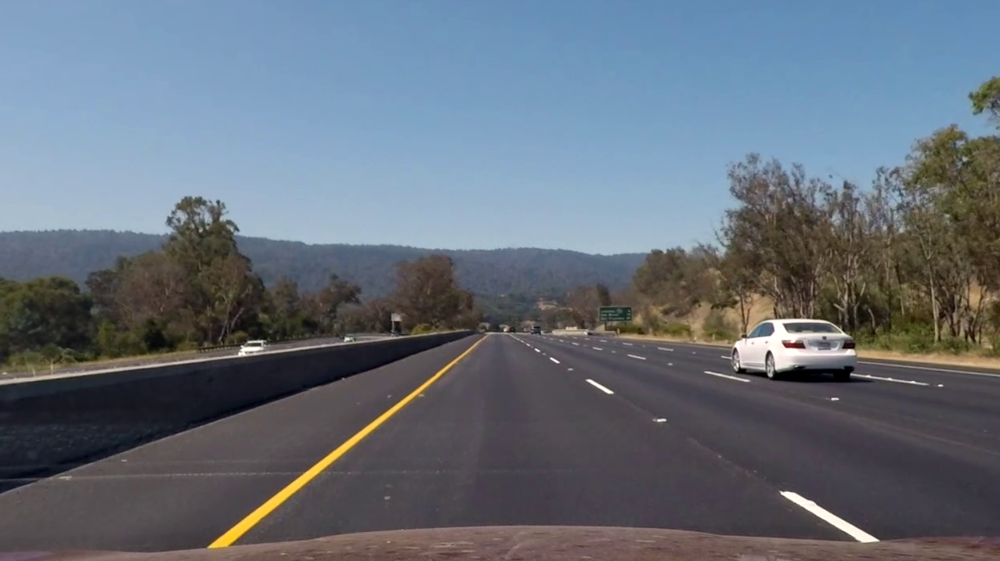 | 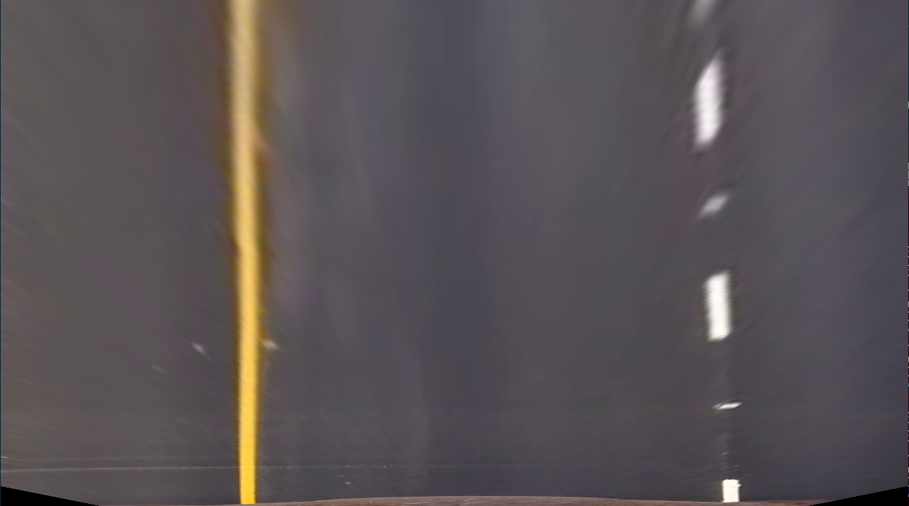 | 

Here is another example of the perspective transform, this time on a curved road.

| Source        | Destination (Perspective Transform)   | 
|:-------------:|:-------------:| 
| 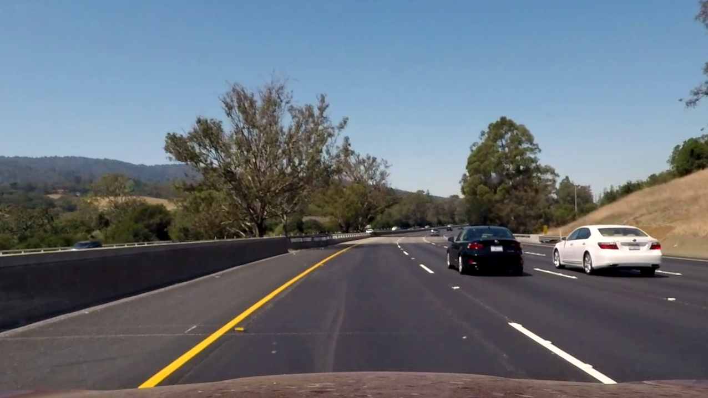 | 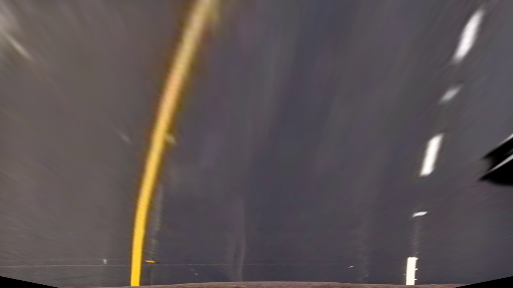 | 

#### 4. Describe how (and identify where in your code) you identified lane-line pixels and fit their positions with a polynomial?

Then I did some other stuff and fit my lane lines with a 2nd order polynomial kinda like this:

![alt text][image5]

#### 5. Describe how (and identify where in your code) you calculated the radius of curvature of the lane and the position of the vehicle with respect to center.

I did this in lines # through # in my code in `my_other_file.py`

#### 6. Provide an example image of your result plotted back down onto the road such that the lane area is identified clearly.

I implemented this step in lines # through # in my code in `yet_another_file.py` in the function `map_lane()`.  Here is an example of my result on a test image:

![alt text][image6]

---

### Pipeline (video)

#### 1. Provide a link to your final video output.  Your pipeline should perform reasonably well on the entire project video (wobbly lines are ok but no catastrophic failures that would cause the car to drive off the road!).

Here's a [link to my video result](./project_video.mp4)

---

### Discussion

#### 1. Briefly discuss any problems / issues you faced in your implementation of this project.  Where will your pipeline likely fail?  What could you do to make it more robust?

Here I'll talk about the approach I took, what techniques I used, what worked and why, where the pipeline might fail and how I might improve it if I were going to pursue this project further.  
